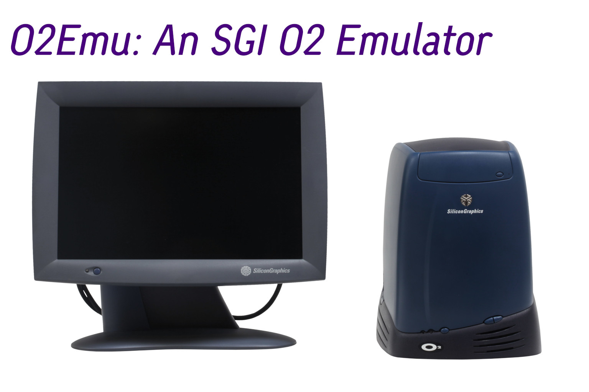

# Attention:This README.md originally came from the O2Emu Project. O2Rust is a Rust Version of O2Emu. Check O2Emu at (https://github.com/samueltgg12/o2emu)

# O2Rust: An Rust-written SGI O2 (IP32/Moosehead) Emulator

A from-scratch emulator for the **SGI O2** workstation (codename **"Moosehead"**,
SGI IP32). **Phase 1 (Research) is already completed thanks to the O2Emu Project!** — every
hardware subsystem has a sourced register map, and the Rust emulator
(CPU, memory, graphics, I/O, PROM firmware, GUI) is in Progress.

> **Status: Phase 1 already complete, Phase 2 starting.** All hardware documentation
> is in [`docs/`](docs/), including the SGI ASIC specs (CRIME/MACE/GBE/VICE)
> under [`docs/manuals-specs/`](docs/manuals-specs/).

## What is the SGI O2?

The O2 is a 1996 SGI workstation built around a proprietary high-bandwidth
**Unified Memory Architecture (UMA)** — the CPU, graphics, and I/O all share a
single pool of main memory over a 133 MHz 144-bit bus (128-bit data + ECC).

- **CPU:** MIPS R5000/RM7000 (low-end) or R10000/R12000 (high-end)
- **Memory:** up to 1 GB of proprietary 239-pin SDRAM DIMMs (8 slots)
- **Graphics:** CRM chipset (Microprocessor + ICE, MRE, Display ASICs) — no
  separate VRAM; textures/framebuffer live in main memory
- **I/O:** MACE ASIC (64-bit PCI, ISA, PS/2, 10/100 Ethernet), UltraWide SCSI
- **OS:** IRIX 6.3/6.5.x (native), Linux, OpenBSD, NetBSD

## Project goals

1. **Document** the O2 hardware in exhaustive detail (registers, memory map,
   firmware) — see [`docs/`](docs/).
2. **Emulate** the machine: CPU, memory controller (MRE), graphics (CRM),
   I/O (MACE), and the IP32 PROM firmware.
3. **Boot** IRIX and/or a hobbyist OS on the emulator.

## Roadmap

This project is developed in three phases. See
[ROADMAP.md](ROADMAP.md) for the full plan.

- **Phase 1 — Research ✅ complete:** exhaustive, well-sourced hardware
  documentation under [`docs/`](docs/). All register maps sourced.
- **Phase 2 — Emulation (current):** a full-fledged C++ emulator, as accurate
  to the hardware as the documentation and specs allow. CPU, memory, graphics,
  I/O, and the PROM firmware, with a GUI.
- **Phase 3 — Performance & polish (After Phase 2):** JIT compilation, optimizations,
  GUI improvements, cross-platform support, and full-featured emulator features.

## Documentation

| Topic | File |
|-------|------|
| System architecture | [docs/architecture.md](docs/architecture.md) |
| CPU & memory | [docs/cpu-memory.md](docs/cpu-memory.md) |
| Graphics (CRM/ICE/MRE/Display) | [docs/graphics.md](docs/graphics.md) |
| I/O (MACE, PCI, SCSI, Ethernet) | [docs/io.md](docs/io.md) |
| Register maps (from drivers) | [docs/register-maps.md](docs/register-maps.md) |
| PROM firmware | [docs/prom.md](docs/prom.md) |
| Research sources | [docs/sources.md](docs/sources.md) |
| Phase 1 checklist | [docs/phase1-checklist.md](docs/phase1-checklist.md) |

## Firmware

The actual IP32 PROM images are included in [`samples/`](samples/):

- `ip32prom.rev4.18.bin` — MD5 `c9725e036052cf1f3e6258eb9bc687fa`
- `ip32prom.rev4.3.bin` — MD5 `6b86b20727a598ed15d93f27c9a3f2e8`

The PROM has also been **decompiled into MIPS assembly** under
[`samples/decompiled-prom/`](samples/decompiled-prom/). The auto-generated
`definitions.h` is the authoritative source for the IP32 address map and the
CRIME/MACE/UART/RTC register maps.

## Research sources

- **Linux kernel** — `arch/mips/sgi-ip32/` and `arch/mips/include/asm/ip32/`
- **NetBSD** — `sys/arch/sgimips/`
- **Leaked IRIX source** — IRIX 6.5.7m and 6.5.17 (includes the actual IP32
  PROM source under `stand/arcs/`)
- **`mattst88/ip32prom-decompiler`** — Rust tool for decompiling the IP32 PROM

See [docs/sources.md](docs/sources.md) for the full list.

## License

BSD 3-Clause License. See [LICENSE](LICENSE).